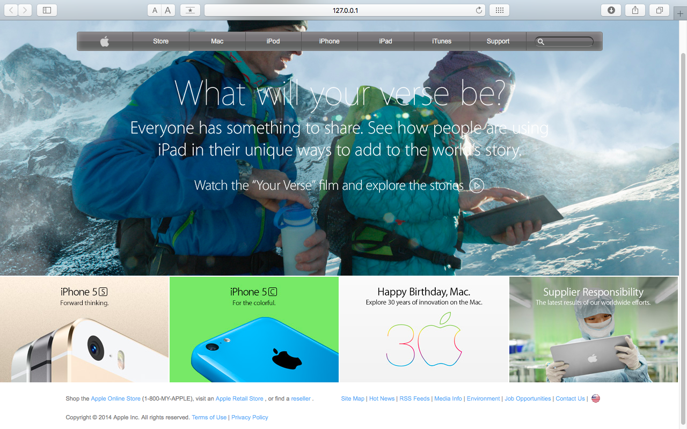

# Apple [Solo Project]
A clone of an Apple's website illustrating the use of background images and gradients for elements' background

> This project consists of building an HTML page that matches the appearance of an old version of Apple's presesentation page. Gradient is used for the navigation bar and background images are set to the body of the html and the promotional panels at the bottom. Additionally the like-header text elements in the middle of the page are implemented using images downloaded from Apple's archive github

The purpose of this project is to clone the appearance of an old version of Apple's presesentation page.

## Built With

- HTML,
- CSS

## Live Demo

[Live Demo Link](https://rawcdn.githack.com/ioanniskousis/apple/6695714575ecea5f463f8ebd05b16f9ad405a0ba/index.html)

## Getting Started

To get a local copy up and running follow these simple example steps.

### Prerequisites

#### You should have installed git on your local machine and a text editor preferably VS Code.

### Setup

#### Clone the repository into your local machine.

## 👤 Author
## Ioannis Kousis

- Github: [@ioanniskousis](https://github.com/ioanniskousis)
- Twitter: [@ioanniskousis](https://twitter.com/ioanniskousis)
- Linkedin: [Ioannis Kousis](https://www.linkedin.com/in/ioannis-kousis-9a5051b4/)

## 🤝 Contributing

Contributions, issues and feature requests are welcome!

Feel free to check the [issues page](issues/).

## Show your support

Give a ⭐️ if you like this project!

## Acknowledgments

- Appreciation to my coding Partner and mentor

## 📝 License

This project is [MIT](lic.url) licensed.
